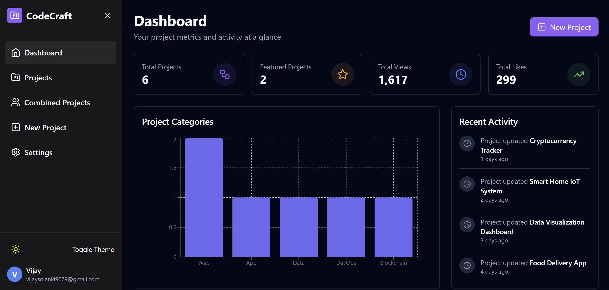
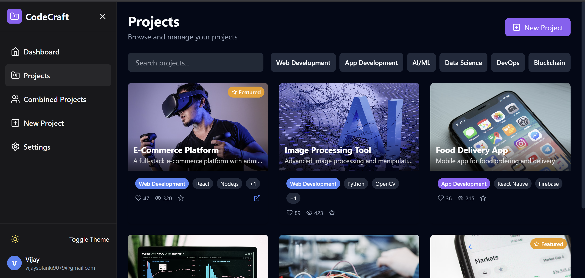

# CodeCraft

CodeCraft is a modern web application for managing and showcasing development projects. Built with cutting-edge technologies, it provides a platform for developers to organize, share, and track their coding projects efficiently.




## Features

- **Project Management**: Create, edit, and organize your development projects
- **Tech Stack Tracking**: Keep track of technologies used in each project
- **Project Analytics**: Monitor views, likes, and engagement metrics
- **Responsive Design**: Works seamlessly across all devices
- **Modern UI**: Clean and intuitive user interface

## Technologies Used

- React
- TypeScript
- Tailwind CSS
- Vite
- Bun

## Getting Started

1. Clone the repository
2. Install dependencies:
   ```bash
   bun install
   ```
3. Start the development server:
   ```bash
   bun run dev
   ```

## Project Structure

```
src/
├── components/          # Reusable UI components
│   ├── ui/             # Basic UI components (buttons, inputs, etc.)
│   ├── layout/         # Layout components (sidebar, header, etc.)
│   └── project/        # Project-related components
├── pages/              # Page components
│   ├── Dashboard/      # Dashboard page and related components
│   ├── Projects/       # Projects page and related components
│   └── Settings/       # Settings page and related components
├── types/              # TypeScript type definitions
│   ├── project.ts      # Project-related types
│   └── user.ts         # User-related types
├── utils/              # Utility functions
│   ├── api.ts          # API-related utilities
│   └── helpers.ts      # Helper functions
├── lib/                # Library and configuration files
│   ├── utils.ts        # Common utilities
│   └── constants.ts    # Application constants
└── assets/             # Static assets
    ├── images/         # Image files
    └── icons/          # Icon files
```

## Contributing

Contributions are welcome! Please feel free to submit a Pull Request.

## License

This project is licensed under the MIT License - see the LICENSE file for details.
